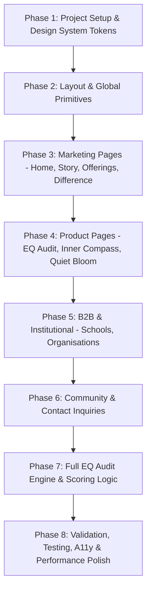

# SoulfulI — Master Implementation Plan

> **Product Vision**: *Understand yourself deeply enough to live differently.*  
> **Philosophy**: *Mind + Heart + Spirit → One Journey → A More Whole You*  
> **Aesthetic Archetype**: *Soulful Editorial Modernity — literary broadsheet restraint, warm ivory canvas, deep forest grounding, muted sage & terracotta accents, dignified contemplation.*

---

## A. Project Audit

### 1. Existing Directory State
Inspection of `d:\HARSH-PROJECT` reveals:
- **`PRD.md`** (36.6 KB): Complete product specification containing 80 detailed sections covering philosophy, audience, pages, EQ Audit, B2B offerings, retreats, performance, accessibility, and tech requirements.
- **`AGENTS.md`** (25.5 KB): 67 strict engineering and product rules covering architecture, component taxonomy, styling, security, data validation, and development boundaries.
- **`DESIGN/`**: Full Stitch UI Design System export directory containing:
  - `soulful_editorial_modernity/DESIGN.md`: Complete design system tokens, color roles, typography scales, elevation, shape definitions, and component guidelines.
  - 11 screen directories, each containing high-fidelity `code.html` (semantic Tailwind/HTML markup) and `screen.png` previews.
- **`.agents/skills/frontend-design/SKILL.md`**: Design skill emphasizing intentional, editorial aesthetics, authentic typography scales, avoidance of generic AI/SaaS tropes, and disciplined visual restraint.
- **Status**: Greenfield codebase ready for architecture setup without legacy tech debt or conflicting implementations. No package.json or production source code exists yet.

---

## B. PRD Summary

### 1. Product Identity & Purpose
SoulfulI is a human-development platform that sits at the intersection of emotional intelligence, mindfulness, and spirituality. It is neither a generic wellness blog, an AI chatbot, a corporate HR dashboard, nor a religious platform. It offers a quiet, contemplative digital sanctuary for self-awareness and intentional living.

### 2. Core Emotional Arc
$$\text{NOISE} \longrightarrow \text{PAUSE} \longrightarrow \text{AWARENESS} \longrightarrow \text{UNDERSTANDING} \longrightarrow \text{DIRECTION} \longrightarrow \text{CONNECTION} \longrightarrow \text{BLOOM}$$

### 3. Key Offerings & User Journeys
1. **EQ Audit (B2C Core)**: 48-question reflective self-discovery mirror assessing 6 dimensions, delivering an interactive *Inner Map* and personalized growth pathway.
2. **Inner Compass (B2C Deeper)**: 5-pillar developmental program (*Know Yourself, Choose Yourself, See Others, Read the Room, Speak with Intention*).
3. **Quiet Bloom (Premium Experience)**: Himalayan retreat in Dharamshala focusing on village immersion, mountain silence, and stillness.
4. **Schools & Colleges (B2B / Institutions)**: Human-development curriculum, self-awareness workshops, and mindful communication for students and faculty.
5. **Organisations (B2B / Enterprise)**: Non-reactive leadership, emotional regulation, and relational culture transformation.
6. **Community (Ecosystem)**: Seasonal evening salons, contemplative circles, newsletters, and shared practice.

---

## C. AGENTS Rules Summary

1. **Monolithic Next.js App Router**: Server Components by default; Client Components (`"use client"`) only for user interactivity, client state, and browser APIs.
2. **Strict TypeScript & Zero `any`**: Explicit interfaces, schema-validated inputs, typed database models.
3. **Design Tokens First**: Tailwind CSS configured with centralized design tokens matching `DESIGN.md`; no arbitrary hard-coded hex colors in components.
4. **No Feature Invention**: Absolutely no chatbots, gamification, badges, countdown timers, social media feeds, or clinical diagnostic claims.
5. **Real Content / Explicit Placeholders**: Never invent statistics, fake reviews, or fabricated retreat dates.
6. **Security & Privacy**: Server-side scoring for EQ Audit; all submissions validated via Zod; Row Level Security (RLS) on database; zero secrets committed.
7. **Performance & A11y Quality Bar**: Lighthouse 90+, Next.js Image with WebP/AVIF, responsive typography, WCAG 2.2 AA compliance, `prefers-reduced-motion` support.

---

## D. Stitch Design Analysis (All 12 Screens)

| # | Screen Name / Stitch ID | Visual Role & Page Purpose | Key Layout & Structural Highlights |
|---|---|---|---|
| **1** | **Design System**<br>`asset-stub-assets_1ab046a7aed448bdb8ca9f9e695ce96f` | UI Foundation & Tokens | Warm ivory canvas (`#FAF6EE`), Deep Forest (`#1F2A24`), Newsreader serif, Plus Jakarta Sans, 4px/8px radii, 1px `#DDD6C8` rules. |
| **2** | **Home Page (Emotional Arc)**<br>`2479e72b49ce43278bb6acec1ca82c49` | `/` — Root Portal | Hero "An Invitation to Return", Problem statement ("Checklist trap"), Philosophy triad, 7-stage Emotional Arc narrative, Ecosystem grid, Closing CTA. |
| **3** | **Our Story**<br>`203ef26e4d2543e29edbcce6061c9d07` | `/our-story` — Narrative | "Becoming more yourself", Origin narrative, 3 Core Tenets, The Three Inquiries, Human-centered philosophy manifesto. |
| **4** | **What We Offer**<br>`e992063c1ec649b8b8817b99aa4699dc` | `/what-we-offer` — Ecosystem Overview | 5 Ecosystem pillars, layered cards, audience segment routing (Individuals, Leaders, Retreat Seekers, Educators). |
| **5** | **EQ Audit**<br>`3d373ad1e7f14348aeb54a8467f51d50` | `/eq-audit` — Interactive Experience | Step-by-step reflection flow, calm question cards with 1-5 scale, real-time progress bar, email capture, 6-dimension Inner Map radar/bar results. |
| **6** | **Inner Compass**<br>`aeccbbc36c9a4efd9ee6503f3661f3f0` | `/inner-compass` — Guided Journey | 5 modules breakdown, curriculum accordion, reflection prompts, cohort enquiry form. |
| **7** | **Quiet Bloom**<br>`10ede9f64a40469fbb48a3caef76623e` | `/quiet-bloom` — Himalayan Retreat | Cinematic hero with Dharamshala vista, seasonal rhythm schedule, quiet accommodation details, curated enquiry form. |
| **8** | **Schools & Colleges**<br>`ab293b070a3043f3b5f5f4601564352c` | `/schools-colleges` — Institutional | Youth emotional crisis context, 4 curricular threads, student & educator outcomes, institutional consultation form. |
| **9** | **Organisations**<br>`903a6ecf6cec4b27b86135712f98d1e8` | `/organisations` — B2B Leadership | Leadership burnout & reactivity problem, 6 organizational competencies, enterprise workshop tiers, B2B proposal request form. |
| **10** | **What Makes Us Different**<br>`66376e6b039a4fb3bd9c4a91fa7ca771` | `/what-makes-us-different` — Differentiation | 4 Provocations ("Not a mood board, not an app notification, not a productivity hack"), 4-step progression line, holistic unity thesis. |
| **11** | **Community**<br>`b497300377cf4b1982a6fc72b0443826` | `/community` — Collective Sanctuary | 5 shared values, seasonal evening salons & quiet circles, dispatch reflection archive, community joining intake. |
| **12** | **Contact**<br>`c67d45c5d7b946a3890040b2b7b61793` | `/contact` — Direct Dispatch | Multi-pathway inquiry form (General, Retreat, Corporate, Education), location details, response expectation pledge. |

---

## E. Stitch Asset Analysis

1. **Fonts (Google Fonts / Next Font)**:
   - Display / Headline: **Newsreader** (Serif, weights 300..700, italic)
   - Interface / Body: **Plus Jakarta Sans** (Sans-Serif, weights 300..700)
   - Icons: **Material Symbols Outlined** (lightweight optical sizes) / Lucide-React icons matched to Stitch glyphs.
2. **Photography & Visual Assets**:
   - High-resolution editorial photography of Himalayan vistas (Dharamshala), quiet tea pavilions, reflective walking paths, warm stone interiors, natural light, and authentic human connection.
   - Hosted CDN assets from Stitch will be cached and downloaded to `/public/images/` to prevent external dependency failures and optimize via `next/image`.

---

## F. Design System Tokens & Specs

```css
/* Core Color Palette */
--color-surface: #FDF9F1;             /* Warm Ivory base */
--color-surface-container-low: #F7F3EB;
--color-surface-container: #F1EDE6;   /* Soft Sand */
--color-surface-container-high: #ECE8E0;
--color-primary: #1F2A24;             /* Deep Forest */
--color-secondary: #7D8B78;           /* Muted Sage */
--color-tertiary: #C86D51;            /* Terracotta Accent */
--color-on-surface: #1C1C17;          /* Deep Charcoal */
--color-on-surface-variant: #434844;  /* Muted Stone */
--color-outline: #737874;
--color-outline-variant: #DDD6C8;     /* Hairline rule */
```

- **Border Radii**: 4px (`0.25rem`) default on inputs and cards, 8px (`0.5rem`) on hero/modals, `9999px` on pills/chips.
- **Grid & Spacing**: 12-column desktop (1240px max-width, 32px gutters, 64px margins), 8-column tablet, 4-column mobile.
- **Hairlines**: Subtle 1px borders in `#DDD6C8` instead of drop shadows or heavy boxes.

---

## G. Page Mapping & Route Architecture

```
src/
└── app/
    ├── layout.tsx                     # Global HTML layout with Newsreader + Plus Jakarta Sans & Navigation
    ├── page.tsx                       # / -> Home Page (Emotional Arc)
    ├── our-story/page.tsx             # /our-story -> Origin & Philosophy
    ├── what-we-offer/page.tsx         # /what-we-offer -> Ecosystem Overview
    ├── eq-audit/
    │   ├── page.tsx                   # /eq-audit -> Landing & Interactive Audit Container
    │   └── results/page.tsx           # /eq-audit/results -> Inner Map & Growth Pathway
    ├── inner-compass/page.tsx         # /inner-compass -> Guided 5-Module Program
    ├── quiet-bloom/page.tsx           # /quiet-bloom -> Dharamshala Himalayan Retreat
    ├── schools-colleges/page.tsx      # /schools-colleges -> Education Curriculum
    ├── organisations/page.tsx         # /organisations -> B2B Leadership & Culture
    ├── what-makes-us-different/page.tsx # /what-makes-us-different -> Differentiation
    ├── community/page.tsx             # /community -> Shared Gatherings & Dispatch
    ├── contact/page.tsx               # /contact -> Multi-pathway Inquiry Form
    ├── privacy/page.tsx               # /privacy -> Privacy Policy
    └── terms/page.tsx                 # /terms -> Terms of Service
```

---

## H. Component Architecture

```
src/components/
├── layout/
│   ├── Header.tsx                     # Minimalist fixed masthead (Warm Ivory 95% opacity, Newsreader wordmark)
│   ├── Footer.tsx                     # Deep Forest meditation footer with dispatch signup & sitemap
│   ├── MobileNav.tsx                  # Accessible slide-over navigation with focus trap
│   └── SectionContainer.tsx           # 1240px max-width container with responsive guttering
├── ui/ (shadcn-compatible custom styled primitives)
│   ├── Button.tsx                     # Primary (Deep Forest), Secondary (Sand), Ghost (Terracotta underline)
│   ├── Input.tsx                      # Sand background, 1px outline-variant, Deep Forest focus ring
│   ├── Textarea.tsx
│   ├── Select.tsx
│   ├── Accordion.tsx                  # Clean hairline-divided accordion with delicate serif indicators (+ / -)
│   ├── Badge.tsx                      # Capsule pill status chips
│   └── Dialog.tsx
├── shared/
│   ├── SectionHeading.tsx             # Tracked uppercase label + Newsreader display headline
│   ├── EditorialQuote.tsx             # Newsreader italic quote with Terracotta left border
│   ├── ImageTextBlock.tsx             # 7:5 / 8:4 asymmetric editorial image + narrative block
│   ├── OfferingCard.tsx               # 1px framed sand card for offerings & programs
│   ├── ProgressionTimeline.tsx        # 4-stage connected milestone timeline
│   └── ClosingCTA.tsx                 # Contemplative page-closing banner
├── audit/
│   ├── AuditIntro.tsx                 # Calm intro with intention setting
│   ├── AuditQuestionCard.tsx          # Single-question display with 1-5 reflective scale
│   ├── AuditProgressBar.tsx           # Hairline progress indicator with dimension marker
│   ├── AuditEmailStep.tsx             # Optional email capture step
│   ├── InnerMapRadar.tsx              # 6-dimension visual radar/spider chart
│   ├── DimensionBreakdown.tsx         # Dimension scores, strengths & growth opportunities
│   └── RecommendedPathway.tsx        # Tailored next step (Inner Compass / Quiet Bloom)
└── forms/
    ├── ContactForm.tsx                # General inquiries
    ├── OrganisationEnquiryForm.tsx    # B2B team & leadership scope form
    ├── SchoolEnquiryForm.tsx          # Educational institution intake form
    ├── RetreatEnquiryForm.tsx         # Quiet Bloom cohort inquiry form
    └── NewsletterForm.tsx             # Dispatch subscription
```

---

## I. EQ Audit Engine Architecture

1. **Structure**: 48 questions across 6 core dimensions (8 questions per dimension):
   - Dimension 1: *Emotional Awareness*
   - Dimension 2: *Emotional Regulation*
   - Dimension 3: *Pattern Recognition*
   - Dimension 4: *Empathy & Resonance*
   - Dimension 5: *Social Intelligence*
   - Dimension 6: *Intentional Communication*
2. **Server-Side Scoring Logic** (`src/lib/audit/scoring.ts`):
   - Computes normalized scores (0–100) per dimension.
   - Calculates primary emotional strengths and primary growth inquiry areas.
   - Generates tailored reflective insights without diagnostic or clinical claims.
3. **State Management**:
   - Lightweight client state during assessment with `localStorage` backup for interruption recovery.
   - Server Action submission to compute results securely, persist to Supabase if configured, and deliver interactive results.

---

## J. Form & Lead Architecture

- **Validation**: Schema-driven using **Zod** (`src/lib/validation/schemas.ts`).
- **Server Actions**: Direct Next.js Server Actions with anti-spam honeypot and rate limiting.
- **Email Notifications**: Triggered via **Resend** to send instant admin dispatch notifications and confirmation to the inquirer.
- **States**: Every form explicitly handles `idle`, `submitting`, `success` (calm confirmation message), and `error` (actionable guidance).

---

## K. Performance, Accessibility & SEO Plan

- **Performance**:
  - Zero heavy 3D or physics libraries; pure CSS transitions.
  - Native `next/image` with WebP format and defined aspect ratios to prevent CLS.
  - Target Lighthouse 95+ across Mobile and Desktop.
- **Accessibility (WCAG 2.2 AA)**:
  - Contrast ratios $\ge 4.5:1$ across all text against Warm Ivory / Deep Forest canvas.
  - Keyboard accessible navigation with visible focus rings (`focus-visible:ring-2`).
  - Screen reader friendly ARIA labels and live regions for dynamic audit state changes.
  - Full support for `prefers-reduced-motion: reduce`.
- **SEO**:
  - Dynamic OpenGraph cards, JSON-LD structured data (`Organization`, `EducationalOrganization`, `Event`).
  - Dynamic `sitemap.ts` and `robots.ts`.

---

## L. Implementation Phases



- **Phase 1**: Next.js App Router initialization, TypeScript, Tailwind CSS configuration with exact tokens from `DESIGN.md`, font setup (`Newsreader` + `Plus Jakarta Sans`).
- **Phase 2**: Global Layout (`Header`, `Footer`, `MobileNav`), base UI primitives (`Button`, `Input`, `Textarea`, `Accordion`, `Badge`).
- **Phase 3**: Marketing pages (`/`, `/our-story`, `/what-we-offer`, `/what-makes-us-different`).
- **Phase 4**: Product experiences (`/eq-audit` landing, `/inner-compass`, `/quiet-bloom`).
- **Phase 5**: B2B institutional pages (`/schools-colleges`, `/organisations`).
- **Phase 6**: Community & Contact pages (`/community`, `/contact`, `/privacy`, `/terms`) + Zod forms.
- **Phase 7**: Full 48-question EQ Audit engine, server scoring, and Inner Map visualizer.
- **Phase 8**: Vitest unit tests, Playwright E2E flows, accessibility audit, SEO metadata, performance verification.

---

## M. Dependencies

### Required Packages:
```json
{
  "dependencies": {
    "next": "^14.2.0",
    "react": "^18.3.0",
    "react-dom": "^18.3.0",
    "lucide-react": "^0.378.0",
    "clsx": "^2.1.1",
    "tailwind-merge": "^2.3.0",
    "zod": "^3.23.8"
  },
  "devDependencies": {
    "typescript": "^5.4.5",
    "@types/node": "^20.12.7",
    "@types/react": "^18.3.1",
    "@types/react-dom": "^18.3.0",
    "tailwindcss": "^3.4.3",
    "postcss": "^8.4.38",
    "autoprefixer": "^10.4.19",
    "vitest": "^1.6.0",
    "@playwright/test": "^1.44.0"
  }
}
```
*Optional integration packages (Supabase, Resend, Sanity, PostHog, Sentry) will be configured cleanly with fallback mock implementations for local testing before external keys are configured.*

---

## N. Open Questions & Assumptions

- **Assumption 1 (Retreat Booking)**: In alignment with PRD §38 & AGENTS §36, Quiet Bloom retreat reservations are inquiry-based for MVP with no complex third-party booking or payment gateway.
- **Assumption 2 (Content Source)**: Initial marketing content will be embedded into typed static data files that directly mirror Sanity document schemas, enabling zero-friction migration to Sanity Studio without breaking code.
- **Assumption 3 (Asset Hosting)**: All Stitch images will be localized into `/public/images/` to ensure offline stability, zero broken links, and full `next/image` optimization.
